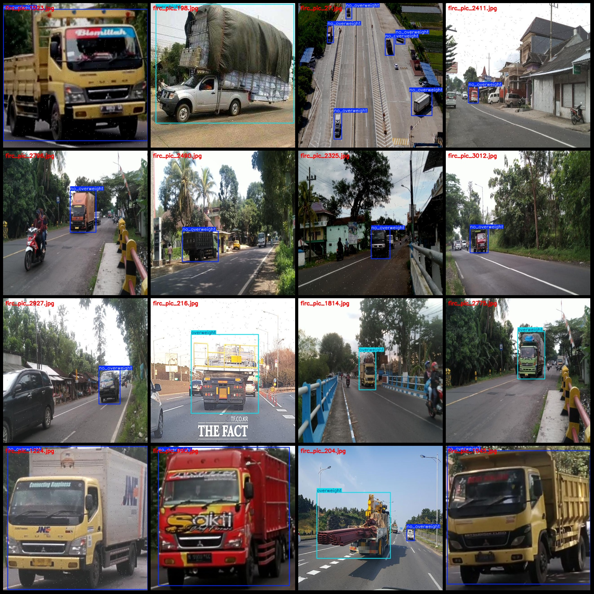
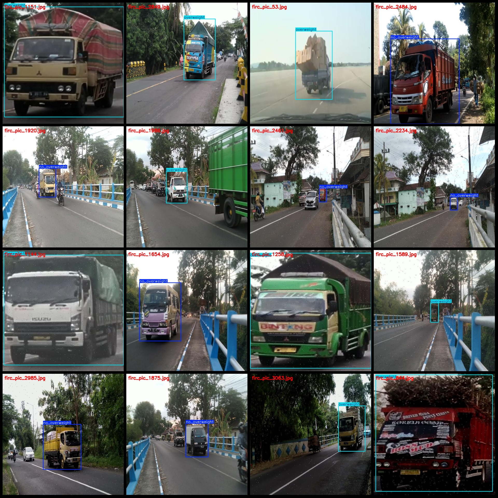

# Truck Overloading Recognition Dataset VOC+YOLO in Pascal VOC format + YOLO format (without split path in txt files, only containing jpg images and corresponding VOC format xml files and YOLO format 
txt files)

Dataset format: Pascal VOC format + YOLO format (txt files without split paths, only containing jpg images and corresponding VOC format xml files and YOLO format txt files)
Number of images (jpg file count): 3165
Number of annotations (xml file count): 3165
Number of annotations (txt file count): 3165
Number of annotation categories: 2
Annotation category names (note that the order of labels in the YOLO format is not consistent with this, but is based on the labels folder "classes.txt"): ["no_overweight", "overweight"]
Box counts per category:
No overweight boxes = 2082
Overweight boxes = 1720
Total boxes = 3802
Box counts per image for each category:
No overweight images = 1700
Overweight images = 1614
Image resolution: 640x640
Annotation tool used: labelImg
Annotation rules: draw bounding boxes for categories
Important note: The dataset does not have a division into training, validation, or test sets; users must divide it themselves.
Special declaration: This dataset does not guarantee the accuracy of models or weight files trained on it.
Image preview:
Annotation examples:

## Images

Here is a pay link on Stripe ( https://buy.stripe.com/3cs8yP7sY87d0vu9AB ). Please contact me lonlonago@foxmail.com after funding $89, and I will send you a complete data files , thank you!

